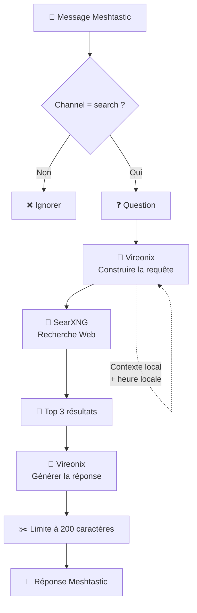

# meshtastic_search_bot

## Installation

### 1. Configurer les variables d'environnement

Copier le fichier d'exemple et adapter les valeurs dans `.env` :

```bash
cp .env.example .env
```

La variable `SEARXNG_URL` doit pointer vers l'API de recherche SearXNG utilisée par le bot :

```dotenv
SEARXNG_URL="http://core:8080/search"
```

Le bot et SearXNG communiquent sur le réseau interne Docker Compose. SearXNG n'a donc pas besoin d'exposer son port vers l'hôte.

### 2. Démarrer et arrêter les services

```bash
docker compose up -d
docker compose down
```

### 3. Activer le format JSON de SearXNG

Éditer le fichier `core-config/settings.yml` et ajouter `json` à la liste des formats de recherche :

```yaml
search:
	formats:
		- html
		- json
```

Le bot utilise ce format pour récupérer les résultats de recherche avant d'envoyer le contexte au LLM.

Pour reconstruire le bot après une modification du code :

```bash
docker compose up -d --build
```

## Flow de recherche


