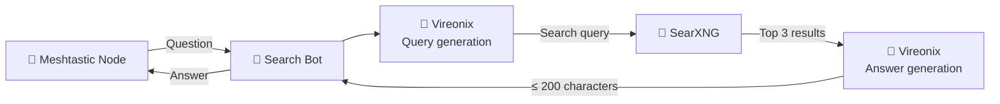
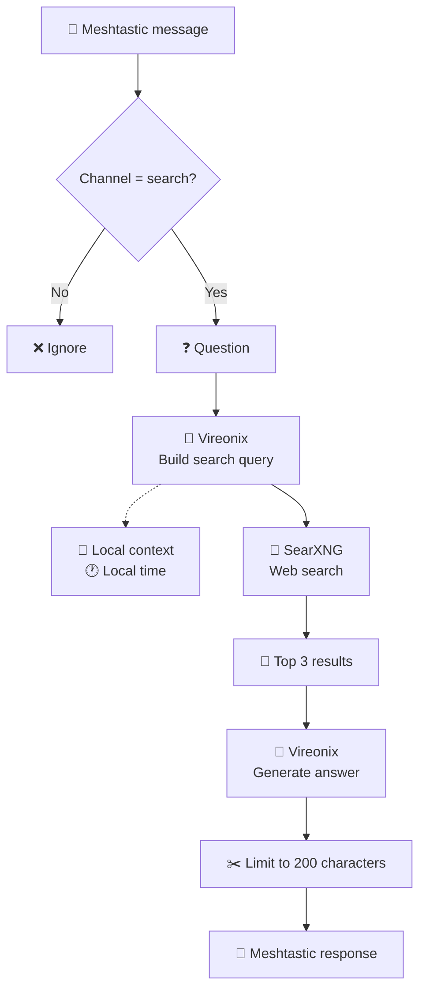
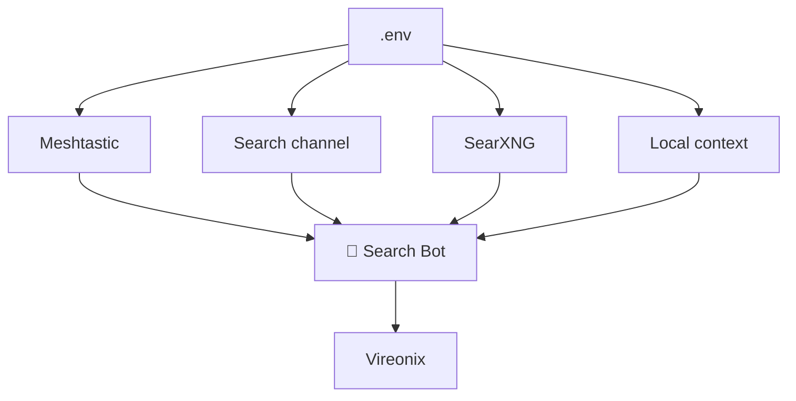

# 📡 Meshtastic Search Bot

A lightweight **Meshtastic Internet search bot** that allows nodes on a Meshtastic network to ask questions and receive concise answers based on live web search results.

The bot listens on a dedicated Meshtastic channel, uses **Vireonix** to build an optimized search query, searches the web through **SearXNG**, then uses Vireonix again to generate a short answer suitable for transmission over LoRa.

> 🌐 **Meshtastic → LLM → SearXNG → LLM → Meshtastic**

---

## ✨ Features

* 📡 Listen to a dedicated Meshtastic channel
* 🔎 Search the web through SearXNG
* 🤖 Use Vireonix for query generation and answer generation
* 📍 Include a configurable local context in searches
* 🕐 Include the local time when generating search queries
* 📄 Use the top 3 SearXNG results as context
* ✂️ Limit responses to 200 characters
* 🐳 Fully Docker Compose based
* 🔄 Automatically reconnect to Meshtastic after connection loss
* 🔐 No external search engine is required — SearXNG can run locally

---

## 🏗️ Architecture



---

## 🔄 Search Flow



---

## 📋 Requirements

* Docker
* Docker Compose
* A Meshtastic node accessible through TCP
* A running SearXNG instance
* A Vireonix API endpoint
* A dedicated Meshtastic channel for the bot

The bot communicates with Meshtastic using the TCP interface, typically on port `4403`.

---

# 🚀 Installation

## 1. Clone the repository

```bash
git clone https://github.com/YR72dpi/meshtastic_search_bot.git
cd meshtastic_search_bot
```

---

## 2. Configure environment variables

Copy the example environment file:

```bash
cp .env.example .env
```

Then edit `.env` according to your setup.

Example:

```dotenv
MESHTASTIC_HOST=192.168.1.161
MESHTASTIC_PORT=4403

CHANNEL_INDEX=2
CHANNEL_NAME=search

SEARXNG_URL=http://core:8080/search

LOCAL_CONTEXT=Rouen, France

RECONNECT_DELAY_SECONDS=10
```

### Environment variables

| Variable                  | Description                        | Example                   |
| ------------------------- | ---------------------------------- | ------------------------- |
| `MESHTASTIC_HOST`         | Meshtastic TCP host                | `192.168.1.161`           |
| `MESHTASTIC_PORT`         | Meshtastic TCP port                | `4403`                    |
| `CHANNEL_INDEX`           | Channel index monitored by the bot | `2`                       |
| `CHANNEL_NAME`            | Human-readable channel name        | `search`                  |
| `SEARXNG_URL`             | SearXNG search endpoint            | `http://core:8080/search` |
| `LOCAL_CONTEXT`           | Local context added to searches    | `Rouen, France`           |
| `RECONNECT_DELAY_SECONDS` | Delay before reconnecting          | `10`                      |

> **Important:** `CHANNEL_INDEX` must match the actual Meshtastic channel index. The bot uses the channel index received from the packet when sending the response.

---

# 🔎 SearXNG Configuration

The bot expects SearXNG to return search results in **JSON format**.

Edit:

```text
core-config/settings.yml
```

and make sure JSON is enabled:

```yaml
search:
  formats:
    - html
    - json
```

The bot then queries:

```text
GET /search?q=<query>&format=json
```

### Docker networking

If SearXNG and the bot are part of the same Docker Compose project, SearXNG does not need to expose its port to the host.

For example:

```dotenv
SEARXNG_URL=http://core:8080/search
```

Here, `core` is the Docker Compose service name.

---

# 🐳 Running the Bot

Start the services:

```bash
docker compose up -d
```

Check the logs:

```bash
docker compose logs -f
```

Stop the services:

```bash
docker compose down
```

---

## 🔨 Rebuild after code changes

When the Python source code changes:

```bash
docker compose up -d --build
```

---

# 🧠 How It Works

When a message is received, the bot first checks that it is a text message and that it was received on the configured search channel.

### 1. Receive the question

Example:

```text
What is the weather in Rouen today?
```

### 2. Generate a search query

Vireonix receives:

* The user's question
* The configured local context
* The current local time

It generates a concise web search query.

Example:

```text
weather Rouen today 24 September 2026
```

### 3. Search the web

The generated query is sent to SearXNG.

The bot retrieves the highest-scoring results and keeps the first three results containing content.

### 4. Generate the answer

The question and search results are sent to Vireonix.

The model is instructed to:

* Answer in French
* Answer directly
* Be concise
* Avoid inventing information
* Use the search context
* Stay below 150 characters

The final result is additionally limited to **200 characters** by the bot.

### 5. Send the answer over Meshtastic

The response is broadcast on the **same channel on which the question was received**.

This is important because it prevents the bot from accidentally replying on another channel.

---

# 📡 Meshtastic Channel

The bot only processes messages received on the configured channel:

```dotenv
CHANNEL_INDEX=2
CHANNEL_NAME=search
```

For example:

```text
0 → LongFast
1 → Meteo
2 → Search
```

A message received on channel `0` or `1` is ignored.

A message received on channel `2` is processed.

The response uses the actual received channel:

```python
interface.sendText(
    answer,
    channelIndex=received_channel
)
```

This ensures that the answer is sent back to the correct channel.

---

# 🔄 Automatic Reconnection

The bot monitors the Meshtastic connection.

If the TCP connection is lost, the bot:

1. Detects the connection loss
2. Closes the existing interface
3. Waits for `RECONNECT_DELAY_SECONDS`
4. Creates a new TCP connection
5. Resumes listening for messages

Example:

```text
[MESHTASTIC] Connexion perdue
[MESHTASTIC] Reconnexion dans 10s...
[MESHTASTIC] Connecté à 192.168.1.161:4403
```

This allows the bot to run continuously without requiring manual intervention after a temporary network failure.

---

# 🖥️ Example

A Meshtastic user sends:

```text
search: What is the latest Raspberry Pi 5 model?
```

The bot processes the request:

```text
📡 Meshtastic
      ↓
🤖 Query generation
      ↓
🔎 SearXNG
      ↓
📄 Top 3 results
      ↓
🤖 Answer generation
      ↓
✂️ ≤ 200 characters
      ↓
📡 Meshtastic
```

Example response:

```text
Le Raspberry Pi 5 existe notamment en versions 2, 4, 8 et 16 Go de RAM.
```

---

# 📁 Project Structure

```text
meshtastic_search_bot/
├── docker-compose.yml
├── Dockerfile
├── .env.example
├── .gitignore
├── requirements.txt
├── core-config/
│   └── settings.yml
└── src/
    └── ...
```

The exact structure may vary depending on the Docker configuration.

---

# 📝 Logging

The bot provides logs for the main stages of the pipeline.

Example:

```text
[BOT] Appel : on_receive
[RX] channel=2 question=What is the weather in Rouen?
[SEARCH] Question de !abcdef: What is the weather in Rouen?
[BOT] Appel : build_search_query
[BOT] Appel : search_searxng
[SEARXNG] ...
[BOT] Appel : generate_answer
[TX] Réponse envoyée sur channel=2 (search)
```

This makes it easier to diagnose problems with:

* Meshtastic connectivity
* Channel configuration
* Vireonix
* SearXNG
* Docker networking

---

# ⚙️ Configuration Overview



---

# 🔐 Privacy

The search infrastructure can be fully self-hosted.

Instead of sending searches directly to a commercial search engine, the bot can communicate with a local SearXNG instance:

```text
Meshtastic
    ↓
Your Bot
    ↓
Your SearXNG
    ↓
Search engines
```

SearXNG acts as the search aggregation layer while keeping the search interface under your control.

The bot itself does not require a database or user account system.

---

# 🛠️ Troubleshooting

### SearXNG returns no results

Check that JSON output is enabled:

```yaml
search:
  formats:
    - html
    - json
```

Then verify the endpoint from inside the Docker network.

---

### The bot receives messages but ignores them

Check:

```dotenv
CHANNEL_INDEX=2
```

Then verify the channel index in the bot logs:

```text
[RX] channel=2 question=...
```

The received channel must match `CHANNEL_INDEX`.

---

### The bot replies on the wrong channel

Make sure the response uses the received channel:

```python
interface.sendText(
    answer,
    channelIndex=received_channel
)
```

Do not hard-code another channel index.

---

### Meshtastic connection fails

Verify that the TCP interface is reachable:

```bash
nc -zv <MESHTASTIC_HOST> 4403
```

For example:

```bash
nc -zv 192.168.1.161 4403
```

---

# 📜 License

Add your preferred license here, for example:

```text
MIT License
```

---

## 🤝 Contributing

Issues, improvements and pull requests are welcome.

If you find a bug or have an idea for improving the search pipeline, feel free to open an issue or submit a pull request.
