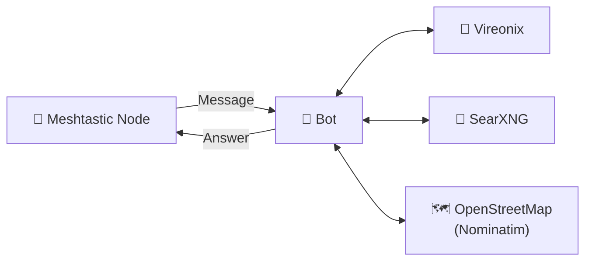
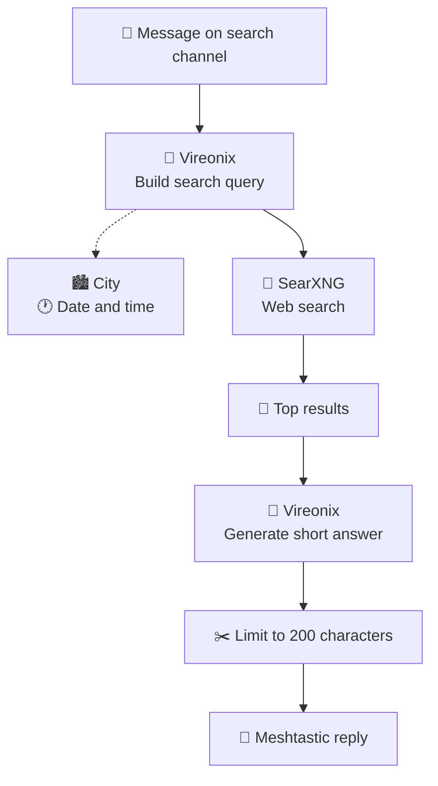
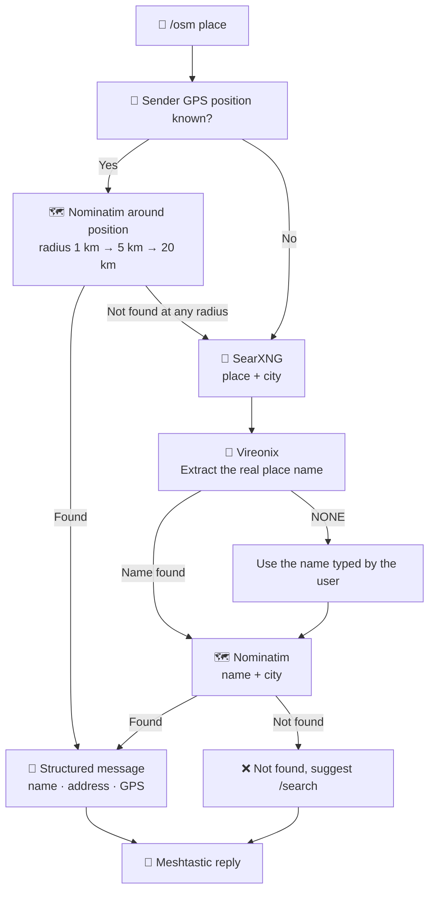

# 📡 Meshtastic Search Bot

A lightweight **Meshtastic Internet assistant**. Nodes on a Meshtastic network can ask questions or look up places and receive short answers suited to LoRa.

The bot listens on a dedicated channel and offers two data sources:

* 🔎 **Web search**: [Vireonix](#-requirements) builds an optimized query, [SearXNG](https://github.com/searxng/searxng) searches the web, Vireonix summarizes the results.
* 🗺️ **OpenStreetMap**: name, address and GPS position of a place, through Nominatim, prioritizing results close to the requesting node when its GPS position is known.

> 🌐 **Meshtastic → LLM → SearXNG → LLM → Meshtastic**
> 🗺️ **Meshtastic → SearXNG → LLM → OpenStreetMap → Meshtastic**

---

## ✨ Features

* 📡 Listens to a dedicated Meshtastic channel
* 💬 Simple commands: `/help`, `/osm`, `/search`, `/github`
* 🔎 Web search through a self-hostable SearXNG instance
* 🤖 Vireonix for query generation, place-name extraction and answer synthesis
* 🗺️ Structured place info from OpenStreetMap (name, address, GPS, phone, opening hours)
* 📍 Distance-aware `/osm` search: uses the sender's GPS position (when known) and expands the search radius (1 km → 5 km → 20 km) until a match is found, keeping the closest result
* 🏙️ Configurable local city added to searches
* 🕐 Local date and time available in prompts
* ✂️ Answers limited to 200 characters
* ↩️ Replies are linked to the original message (`replyId`) when the library supports it
* 🔄 Automatic reconnection after a connection loss
* 🐳 Fully Docker Compose based

---

## 💬 Commands

| Command | Description | Example |
| --- | --- | --- |
| `/help` | 📖 Lists the commands and the configured city | `/help` |
| `/osm [place]` | 🗺️ OpenStreetMap info: name, address, GPS | `/osm Moby's café` |
| `/search [question]` | 🔎 Web search summarized by the LLM | `/search latest Raspberry Pi model` |
| `/github` | 🐙 Link to the repository | `/github` |
| *any other text* | 🔎 Handled like `/search` | `weather in Rouen today?` |

An unknown command returns `❓ Commande inconnue. Tape /help`.

### Example: `/osm`

```text
/osm Moby's café
```

```text
📍 Moby's café
🏠 38, Boulevard de l'Yser, 76000
🧭 49.44860, 1.09928
📞 +33 2 32 10 66 56
```

The `🕒` (opening hours) and `📞` (phone) lines only appear when the data exists in OpenStreetMap.

### Example: `/search`

```text
/search latest Raspberry Pi 5 model
```

```text
Le Raspberry Pi 5 existe notamment en versions 2, 4, 8 et 16 Go de RAM.
```

---

## 🏗️ Architecture


```mermaid
flowchart LR
    M["📡 Meshtastic Node"]
    B["🤖 Bot"]
    V["🧠 Vireonix"]
    S["🔎 SearXNG"]
    O["🗺️ OpenStreetMap<br/>(Nominatim)"]

    M -->|"Message"| B
    B <--> V
    B <--> S
    B <--> O
    B -->|"Answer"| M
```

---

## 🔄 Flows

### `/search`


```mermaid
flowchart TD
    A["📡 Message on search channel"] --> B["🤖 Vireonix<br/>Build search query"]
    B -.-> L["🏙️ City<br/>🕐 Date and time"]
    B --> C["🔎 SearXNG<br/>Web search"]
    C --> D["📄 Top results"]
    D --> E["🤖 Vireonix<br/>Generate short answer"]
    E --> F["✂️ Limit to 200 characters"]
    F --> G["📡 Meshtastic reply"]
```

### `/osm`


```mermaid
flowchart TD
    A["📡 /osm place"] --> P["📍 Sender GPS position known?"]
    P -->|"Yes"| N1["🗺️ Nominatim around position<br/>radius 1 km → 5 km → 20 km"]
    N1 -->|"Found"| F["📍 Structured message<br/>name · address · GPS"]
    N1 -->|"Not found at any radius"| B
    P -->|"No"| B["🔎 SearXNG<br/>place + city"]
    B --> C["🤖 Vireonix<br/>Extract the real place name"]
    C -->|"Name found"| D["🗺️ Nominatim<br/>name + city"]
    C -->|"NONE"| E["Use the name typed by the user"]
    E --> D
    D -->|"Found"| F
    D -->|"Not found"| G["❌ Not found, suggest /search"]
    F --> H["📡 Meshtastic reply"]
    G --> H
```

---

## 📋 Requirements

* Docker and Docker Compose
* A Meshtastic node reachable over TCP (usually port `4403`)
* A running SearXNG instance with JSON output enabled
* A Vireonix API endpoint
* A dedicated Meshtastic channel for the bot
* Internet access to Nominatim (`nominatim.openstreetmap.org`) for `/osm`

---

# 🚀 Installation

## 1. Clone the repository

```bash
git clone https://github.com/YR72dpi/meshtastic_search_bot.git
cd meshtastic_search_bot
```

## 2. Configure environment variables

```bash
cp .env.example .env
```

Example `.env`:

```dotenv
MESHTASTIC_HOST=192.168.1.161
MESHTASTIC_PORT=4403

CHANNEL_INDEX=2
CHANNEL_NAME=search

SEARXNG_URL=http://core:8080/search

CITY=Rouen, France
TZ_NAME=Europe/Paris
GITHUB_URL=https://github.com/YR72dpi/meshtastic_search_bot

RECONNECT_DELAY_SECONDS=10
```

### Environment variables

| Variable | Description | Default / example |
| --- | --- | --- |
| `MESHTASTIC_HOST` | Meshtastic TCP host | `192.168.1.161` |
| `MESHTASTIC_PORT` | Meshtastic TCP port | `4403` |
| `CHANNEL_INDEX` | Channel index monitored by the bot (**required**) | `2` |
| `CHANNEL_NAME` | Human-readable channel name (logs only) | `search` |
| `SEARXNG_URL` | SearXNG search endpoint | `http://core:8080/search` |
| `CITY` | Local city added to searches and OSM lookups | `Paris, France` |
| `TZ_NAME` | Time zone used for date and time in prompts | `Europe/Paris` |
| `GITHUB_URL` | Link returned by `/github` | repository URL |
| `RECONNECT_DELAY_SECONDS` | Delay before reconnecting | `10` |

> **Important:** `CHANNEL_INDEX` must match the real Meshtastic channel index. The bot replies on the channel the message was received on.

---

# 🔎 SearXNG Configuration

The bot expects SearXNG to return **JSON**. In `core-config/settings.yml`:

```yaml
search:
  formats:
    - html
    - json
```

The bot then calls:

```text
GET /search?q=<query>&format=json
```

If SearXNG and the bot share a Docker Compose project, no host port is needed:

```dotenv
SEARXNG_URL=http://core:8080/search
```

`core` is the Compose service name.

---

# 🗺️ OpenStreetMap (Nominatim)

`/osm` uses the public Nominatim API with `extratags` and `addressdetails` enabled, and French-language results.

When the requesting node's GPS position is known (read from `interface.nodesByNum`), the bot searches within a bounding box (`viewbox` + `bounded=1`) around that position, trying successive radii of **1 km, 5 km then 20 km** until results are found, and keeps the closest one (Haversine distance). If the position is unknown or nothing is found at any radius, it falls back to a plain `name, city` search.

Please respect the [Nominatim usage policy](https://operations.osmfoundation.org/policies/nominatim/):

* Send an identifiable `User-Agent` (for example `meshtastic-search-bot/1.0 (you@example.com)`).
* Do not exceed one request per second — the bot waits 1 second between radius attempts.

Map data © [OpenStreetMap contributors](https://www.openstreetmap.org/copyright), ODbL 1.0.

---

# 🐳 Running the Bot

```bash
docker compose up -d          # start
docker compose logs -f        # follow logs
docker compose down           # stop
```

After any change to the Python code or the prompts, rebuild:

```bash
docker compose up -d --build
```

---

# 🧠 How It Works

The bot only handles **text messages** received on the channel set by `CHANNEL_INDEX`. Everything else is ignored.

### Web search (`/search` or plain text)

1. **Query generation:** Vireonix receives the question, the city and the current date/time, and produces a concise search query.
2. **Search:** the query is sent to SearXNG and the top results are used as context.
3. **Answer:** Vireonix answers in French, directly and concisely, without inventing information. The bot truncates the result to 200 characters.

If Vireonix is unreachable, the bot falls back to the raw question for the search, or returns an excerpt of the results.

### Place lookup (`/osm`)

1. **Position:** the bot tries to read the sender node's GPS position from the Meshtastic interface.
2. **Nearby search:** if a position is known, Nominatim is queried around it with growing radii (1 km, 5 km, 20 km); the closest result is kept.
3. **Fallback search:** without a position, or if nothing was found nearby, SearXNG is queried with `place + city`.
4. **Name extraction:** Vireonix extracts the real place name from the SearXNG results (`NONE` if it finds nothing, in which case the user's text is used).
5. **OpenStreetMap:** Nominatim is queried with `name, city`.
6. **Formatting:** the bot builds the structured message itself, without the LLM, so name, address and GPS coordinates are never altered.

### Replying

The answer is sent on the **same channel** as the question, linked to the original packet ID when supported by the installed `meshtastic` library:

```python
interface.sendText(answer, channelIndex=received_channel, replyId=original_packet_id)
```

> A Meshtastic text message is limited to roughly **230 bytes**, and each emoji counts for about 4 bytes. Keep `/osm` output short.

---

# 🔄 Automatic Reconnection

If the TCP connection to the node drops, the bot:

1. Detects the loss through the `meshtastic.connection.lost` event
2. Closes the existing interface
3. Waits `RECONNECT_DELAY_SECONDS`
4. Opens a new connection and resumes listening

```text
[MESHTASTIC] Connexion perdue.
[MESHTASTIC] Connexion perdue (...), reconnexion dans 10s...
[MESHTASTIC] Connecté à 192.168.1.161:4403
```

---

# 📁 Project Structure

```text
meshtastic_search_bot/
├── docker-compose.yml
├── Dockerfile
├── .env.example
├── requirements.txt
├── main.py                  # Meshtastic connection, reception, reply, reconnection
├── bot.py                   # Commands and answer pipeline
├── prompt/                  # LLM prompts (Markdown templates)
│   ├── extract_place_name.md
│   ├── generate_search_query_for_searXng.md
│   └── generate_answer_from_searxng.md
├── tool/
│   ├── __init__.py
│   ├── vireonix.py          # LLM client
│   ├── searXng.py           # SearXNG client
│   ├── OpenStreetMap.py     # Nominatim client
│   └── utils.py             # Prompt loading, time variables, helpers
└── core-config/
    └── settings.yml         # SearXNG configuration
```

### Prompt templates

Prompts live in `prompt/*.md` and use `[placeholder]` variables replaced at runtime:

| Placeholder | Value |
| --- | --- |
| `[city]` | `CITY` |
| `[day]` | Day of the week (in French) |
| `[date]` | `dd/mm/yyyy` |
| `[time]` | `HH:MM` |
| `[question]` | User question (or text to analyze) |
| `[context]` | Search results |

An unknown placeholder is left as-is and a warning is printed in the logs.

---

# 📝 Logging

Each stage of the pipeline is logged:

```text
[RX] channel=2 question=/osm Moby's café
[SEARCH] Question de !abcdef: /osm Moby's café
[BOT] Appel : answer_question
[BOT] Appel : osm_lookup
[BOT] Appel : extract_place_name
[BOT] Appel : search_place_data
[TX] Réponse envoyée sur channel=2 (search) en réponse à l'id 123456
```

---

# 🔐 Privacy

The search side can be fully self-hosted:

```text
Meshtastic → Your bot → Your SearXNG → Search engines
```

The bot uses no database and no user accounts. Note that `/osm` sends the place name and city to the public Nominatim service.

---

# 🛠️ Troubleshooting

### `ModuleNotFoundError: No module named 'tool'`

The container runs an outdated image, or the folder is missing from it. Check the Dockerfile copies `tool/` and rebuild:

```bash
docker compose build --no-cache && docker compose up
```

Also check `.dockerignore` and any `volumes:` entry that mounts over `/app`.

### `FileNotFoundError` on a prompt

Prompts are read from `/app/prompt`. Check the Dockerfile has `COPY prompt/ ./prompt` and that the file exists:

```bash
docker compose run --rm --entrypoint sh <service> -c "ls -la /app/prompt"
```

### `ZoneInfoNotFoundError`

The slim image may lack time zone data. Add `tzdata` to `requirements.txt` and rebuild.

### SearXNG returns no results

Check that JSON output is enabled (see [SearXNG Configuration](#-searxng-configuration)) and test the endpoint from inside the Docker network.

### The bot receives messages but ignores them

Compare `CHANNEL_INDEX` with the channel shown in the logs:

```text
[RX] channel=2 question=...
```

### `/osm` says the place was not found

Try a more precise name, or use `/search`. Nominatim only knows what is mapped in OpenStreetMap.

### Meshtastic connection fails

```bash
nc -zv <MESHTASTIC_HOST> 4403
```

---

# 📜 License

MIT License (or your preferred license).

---

## 🤝 Contributing

Issues, improvements and pull requests are welcome.